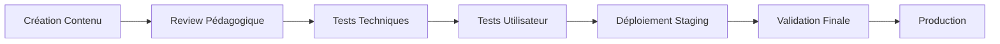

# Guide de Développement de Cours - Data Science Explorer

## 📋 Table des Matières
1. [Vue d'ensemble](#vue-densemble)
2. [Architecture des Composants](#architecture-des-composants)
3. [Standards de Développement](#standards-de-développement)
4. [Méthodes Pédagogiques](#méthodes-pédagogiques)
5. [Structure des Cours](#structure-des-cours)
6. [Composants Réutilisables](#composants-réutilisables)
7. [Guidelines de Contenu](#guidelines-de-contenu)
8. [Tests et Qualité](#tests-et-qualité)
9. [Déploiement et Maintenance](#déploiement-et-maintenance)

---

## 🎯 Vue d'ensemble

Ce document définit les standards et bonnes pratiques pour créer des cours de data science interactifs, modulaires et pédagogiquement efficaces sur la plateforme Data Science Explorer.

### Objectifs
- **Modularité** : Composants réutilisables et faciles à maintenir
- **Interactivité** : Engagement maximum de l'utilisateur
- **Pédagogie** : Progression logique et apprentissage efficace
- **Uniformité** : Expérience cohérente sur tous les cours
- **Évolutivité** : Facilité d'ajout de nouveau contenu

---

## 🏗️ Architecture des Composants

### Structure Hiérarchique

```
/src/components/
├── machinelearning/
│   ├── courses/                      # Cours complets
│   │   ├── SupervisedLearningCourse.tsx
│   │   ├── UnsupervisedLearningCourse.tsx
│   │   └── ReinforcementLearningCourse.tsx
│   ├── sections/                     # Sections modulaires
│   │   ├── IntroSection.tsx
│   │   ├── SupervisedSection.tsx
│   │   └── EvaluationSection.tsx
│   ├── MachineLearningContext.tsx    # Context global
│   └── MachineLearningNav.tsx        # Navigation
├── ui/                              # Composants UI réutilisables
│   ├── educational-cards.tsx
│   ├── interactive-schema.tsx
│   └── glossary-term.tsx
└── layout/                          # Layout et structure
    ├── ContentLayout.tsx
    └── PageHeader.tsx
```

### Principes de Design

1. **Séparation des responsabilités** : Un composant = une fonctionnalité
2. **Composition over inheritance** : Assemblage de petits composants
3. **Props typing** : TypeScript strict pour tous les composants
4. **Stateless quand possible** : Préférer les composants fonctionnels
5. **Context pour l'état global** : Éviter le prop drilling

---

## 📐 Standards de Développement

### Conventions de Nommage

```typescript
// Composants : PascalCase
const EducationalCard = () => {};

// Hooks : camelCase avec prefix 'use'
const useSectionTracker = () => {};

// Types/Interfaces : PascalCase avec suffix 'Type' ou 'Props'
interface EducationalCardProps {
  title: string;
  type: "zoom" | "rappel" | "concept";
}

// Constantes : SCREAMING_SNAKE_CASE
const MAX_QUIZ_ATTEMPTS = 3;

// Variables/fonctions : camelCase
const handleQuizSubmission = () => {};
```

### Structure des Fichiers

```typescript
// 1. Imports (libs externes puis internes)
import React from "react";
import { Card, CardContent } from "@/components/ui/card";

// 2. Types et interfaces
interface CourseProps {
  title: string;
  sections: SectionType[];
}

// 3. Constantes
const DEFAULT_DURATION = "45 min";

// 4. Composant principal
const CourseName = ({ title, sections }: CourseProps) => {
  // 4.1 State et hooks
  const [activeSection, setActiveSection] = useState(0);
  
  // 4.2 Fonctions utilitaires
  const handleSectionChange = (index: number) => {
    setActiveSection(index);
  };
  
  // 4.3 Render
  return (
    <div className="space-y-8">
      {/* Contenu */}
    </div>
  );
};

// 5. Export par défaut
export default CourseName;
```

---

## 🎓 Méthodes Pédagogiques

### Principes Pédagogiques

1. **Progression graduelle** : Du simple au complexe
2. **Apprentissage actif** : Interaction constante
3. **Multimodalité** : Texte, visuel, audio, interactif
4. **Feedback immédiat** : Validation en temps réel
5. **Ancrage mémoriel** : Répétition espacée et contexte

### Types de Contenu

#### 1. Contenu Théorique
```typescript
<EducationalCard title="Concept clé" type="concept">
  <p>Explication claire avec définition précise</p>
  <div className="examples">
    {/* Exemples concrets */}
  </div>
</EducationalCard>
```

#### 2. Contenu Pratique
```typescript
<ExerciseCard 
  title="Exercice guidé"
  problem="Énoncé clair et réaliste"
  solution="Code complet avec commentaires"
  hints={["Indice 1", "Indice 2"]}
  difficulty="intermédiaire"
/>
```

#### 3. Contenu Interactif
```typescript
<QuizCard
  question="Question précise"
  options={["Option A", "Option B", "Option C"]}
  correctAnswer={0}
  explanation="Explication détaillée"
/>
```

---

## 📚 Structure des Cours

### Template de Cours Standard

```typescript
const CourseName = () => {
  return (
    <div className="space-y-12">
      {/* 1. Header avec titre et description */}
      <CourseHeader 
        title="Titre du Cours"
        description="Description engageante"
        badges={["Badge1", "Badge2"]}
      />

      {/* 2. Introduction conceptuelle */}
      <EducationalCard title="Introduction" type="concept">
        {/* Définition et vue d'ensemble */}
      </EducationalCard>

      {/* 3. Analogie pédagogique */}
      <EducationalCard title="Analogie" type="analogie">
        {/* Comparaison avec quelque chose de familier */}
      </EducationalCard>

      {/* 4. Contenu principal par sections */}
      <Tabs defaultValue="section1">
        <TabsList>
          <TabsTrigger value="section1">Section 1</TabsTrigger>
          <TabsTrigger value="section2">Section 2</TabsTrigger>
        </TabsList>
        
        <TabsContent value="section1">
          {/* Contenu théorique + pratique */}
        </TabsContent>
      </Tabs>

      {/* 5. Composants interactifs avancés */}
      <AlgorithmComparison algorithms={algorithmsData} />

      {/* 6. Points clés et bonnes pratiques */}
      <EducationalCard title="Rappels importants" type="rappel">
        {/* Pièges à éviter + bonnes pratiques */}
      </EducationalCard>

      {/* 7. Quiz d'évaluation */}
      <QuizSection questions={quizQuestions} />

      {/* 8. Exercices pratiques */}
      <ExerciseSection exercises={practicalExercises} />

      {/* 9. Fun facts */}
      <EducationalCard title="Le saviez-vous ?" type="saviez-vous">
        {/* Anecdotes et faits intéressants */}
      </EducationalCard>
    </div>
  );
};
```

### Progression Pédagogique

1. **Accroche** (5%) : Titre, description, promesse de valeur
2. **Contextualisation** (10%) : Pourquoi c'est important, applications
3. **Concepts fondamentaux** (25%) : Théorie de base, définitions
4. **Exemples concrets** (20%) : Cas d'usage, démonstrations
5. **Pratique guidée** (25%) : Exercices avec assistance
6. **Pratique autonome** (10%) : Défis et projets
7. **Évaluation** (5%) : Quiz et validation des acquis

---

## 🧩 Composants Réutilisables

### EducationalCard

Composant central pour tous les types de contenu éducatif.

```typescript
interface EducationalCardProps {
  title: string;
  children: React.ReactNode;
  type?: "zoom" | "rappel" | "saviez-vous" | "exemple" | "exercice" | "concept" | "analogie" | "application";
  className?: string;
}

// Utilisation
<EducationalCard title="Titre" type="concept">
  <p>Contenu du concept</p>
</EducationalCard>
```

**Types disponibles :**
- `concept` : Explication théorique fondamentale
- `zoom` : Focus sur un aspect particulier
- `rappel` : Points importants à retenir
- `saviez-vous` : Anecdotes et fun facts
- `exemple` : Cas concrets d'application
- `exercice` : Activité pratique
- `analogie` : Comparaison pédagogique
- `application` : Usage dans le monde réel

### QuizCard

Évaluation interactive avec feedback immédiat.

```typescript
interface QuizProps {
  question: string;
  options: string[];
  correctAnswer: number;
  explanation: string;
  difficulty?: "facile" | "moyen" | "difficile";
}
```

**Bonnes pratiques :**
- Question précise et sans ambiguïté
- 3-4 options maximum
- Explication détaillée pour la bonne réponse
- Distracteurs plausibles mais clairement incorrects

### ExerciseCard

Exercice pratique avec progression guidée.

```typescript
interface ExerciseProps {
  title: string;
  problem: string;
  solution: string;
  hints?: string[];
  difficulty?: "débutant" | "intermédiaire" | "avancé";
  estimatedTime?: string;
}
```

**Structure recommandée :**
1. **Énoncé clair** : Contexte + objectif précis
2. **Hints progressifs** : Guidance sans donner la solution
3. **Solution complète** : Code commenté + explications
4. **Extensions possibles** : Pour aller plus loin

### InteractiveSchema

Visualisations et schémas interactifs.

```typescript
// Workflow interactif
<MLWorkflowSchema activeStep={currentStep} />

// Comparaison d'algorithmes
<AlgorithmComparison algorithms={algorithmsData} />

// Visualisation de concepts
<ConceptVisualization 
  title="Processus"
  concept={conceptDefinition}
/>
```

---

## 📝 Guidelines de Contenu

### Rédaction

#### Ton et Style
- **Ton** : Bienveillant, encourageant, accessible
- **Style** : Conversationnel mais précis
- **Vocabulaire** : Technique quand nécessaire, expliqué systématiquement
- **Longueur** : Paragraphes courts (3-4 lignes max)

#### Structure des Explications
```
1. Définition simple (1 phrase)
2. Analogie ou comparaison (si complexe)
3. Explication détaillée (2-3 phrases)
4. Exemple concret
5. Applications pratiques
```

#### Exemples de Formulations

**❌ Éviter :**
```
"L'algorithme de gradient descent utilise la dérivée partielle 
de la fonction de coût pour optimiser les paramètres θ en 
minimisant J(θ) = 1/2m Σ(hθ(x) - y)²"
```

**✅ Préférer :**
```
Le gradient descent est comme descendre une montagne dans le 
brouillard : on tâtonne pour trouver la pente la plus raide 
vers le bas. L'algorithme calcule cette "pente" (le gradient) 
de notre fonction d'erreur et ajuste les paramètres du modèle 
pour réduire progressivement les erreurs de prédiction.
```

### Code et Exemples

#### Standards de Code
```python
# ✅ Code bien structuré
def train_model(X_train, y_train, learning_rate=0.01, epochs=1000):
    """
    Entraîne un modèle de régression linéaire.
    
    Args:
        X_train: Features d'entraînement (shape: n_samples, n_features)
        y_train: Targets d'entraînement (shape: n_samples,)
        learning_rate: Taux d'apprentissage (défaut: 0.01)
        epochs: Nombre d'itérations (défaut: 1000)
    
    Returns:
        model: Modèle entraîné
        history: Historique des pertes
    """
    # 1. Initialisation des paramètres
    weights = np.random.normal(0, 0.01, X_train.shape[1])
    bias = 0
    history = []
    
    # 2. Boucle d'entraînement
    for epoch in range(epochs):
        # Forward pass
        predictions = X_train @ weights + bias
        loss = np.mean((predictions - y_train) ** 2)
        
        # Backward pass (gradient)
        dw = 2 * X_train.T @ (predictions - y_train) / len(y_train)
        db = 2 * np.mean(predictions - y_train)
        
        # Mise à jour des paramètres
        weights -= learning_rate * dw
        bias -= learning_rate * db
        
        # Enregistrement
        history.append(loss)
        
        # Affichage des progrès
        if epoch % 100 == 0:
            print(f"Époque {epoch}: Loss = {loss:.4f}")
    
    return {"weights": weights, "bias": bias}, history
```

#### Commentaires Pédagogiques
- **Pourquoi** avant **Comment**
- Explication des concepts à chaque étape
- Liens vers la théorie quand pertinent
- Conseils pratiques et pièges à éviter

### Données et Datasets

#### Datasets Recommandés
```typescript
const RECOMMENDED_DATASETS = {
  beginner: [
    "Iris (classification)",
    "Boston Housing (régression)",
    "Titanic (classification binaire)"
  ],
  intermediate: [
    "Wine Quality (classification multi-classe)",
    "California Housing (régression)",
    "Customer Segmentation (clustering)"
  ],
  advanced: [
    "MNIST (computer vision)",
    "IMDb Reviews (NLP)",
    "Stock Prices (séries temporelles)"
  ]
};
```

#### Critères de Sélection
1. **Taille appropriée** : Pas trop volumineux pour les exemples
2. **Complexité graduelle** : Adapté au niveau du cours
3. **Réalisme** : Problèmes du monde réel
4. **Diversité** : Différents types de données
5. **Qualité** : Peu de preprocessing nécessaire

---

## 🧪 Tests et Qualité

### Tests de Composants

```typescript
// __tests__/EducationalCard.test.tsx
import { render, screen } from '@testing-library/react';
import { EducationalCard } from '@/components/ui/educational-cards';

describe('EducationalCard', () => {
  test('renders with correct title and content', () => {
    render(
      <EducationalCard title="Test Title" type="concept">
        <p>Test content</p>
      </EducationalCard>
    );
    
    expect(screen.getByText('Test Title')).toBeInTheDocument();
    expect(screen.getByText('Test content')).toBeInTheDocument();
  });

  test('applies correct styling based on type', () => {
    const { container } = render(
      <EducationalCard title="Test" type="concept">
        Content
      </EducationalCard>
    );
    
    expect(container.firstChild).toHaveClass('border-l-indigo-500');
  });
});
```

### Tests d'Accessibilité

```typescript
// Tests ARIA et navigation clavier
test('quiz is accessible', async () => {
  render(<QuizCard {...quizProps} />);
  
  // Vérifier les labels ARIA
  expect(screen.getByRole('radiogroup')).toHaveAccessibleName();
  
  // Test navigation clavier
  const firstOption = screen.getAllByRole('radio')[0];
  firstOption.focus();
  fireEvent.keyDown(firstOption, { key: 'ArrowDown' });
  
  expect(screen.getAllByRole('radio')[1]).toHaveFocus();
});
```

### Validation de Contenu

#### Checklist Qualité
- [ ] **Progression logique** : Concepts introduits dans l'ordre
- [ ] **Exemples variés** : Différents domaines d'application
- [ ] **Code fonctionnel** : Tous les exemples testés
- [ ] **Accessibilité** : Navigation clavier + lecteurs d'écran
- [ ] **Responsive** : Affichage correct sur tous les écrans
- [ ] **Performance** : Temps de chargement < 3s
- [ ] **SEO** : Métadonnées et structure appropriées

---

## 🚀 Déploiement et Maintenance

### Workflow de Développement



### Versioning et Updates

#### Semantic Versioning pour Cours
```
MAJOR.MINOR.PATCH

MAJOR: Restructuration complète du cours
MINOR: Ajout de nouvelles sections/exercices
PATCH: Corrections, améliorations mineures
```

#### Migration et Backward Compatibility
```typescript
// Gestion des versions d'API
interface CourseConfig {
  version: string;
  deprecated?: boolean;
  migrationPath?: string;
}

const COURSE_CONFIGS: Record<string, CourseConfig> = {
  "machine-learning-v1": {
    version: "1.0.0",
    deprecated: true,
    migrationPath: "/machine-learning-v2"
  },
  "machine-learning-v2": {
    version: "2.0.0"
  }
};
```

### Monitoring et Analytics

#### Métriques Clés
```typescript
interface CourseMetrics {
  completion_rate: number;      // % d'utilisateurs qui finissent
  engagement_time: number;      // Temps moyen passé
  quiz_success_rate: number;    // % de bonnes réponses
  exercise_completion: number;  // % d'exercices terminés
  user_satisfaction: number;    // Note moyenne /5
}
```

#### A/B Testing
```typescript
// Test de nouvelles approches pédagogiques
const ExperimentalQuiz = () => {
  const variant = useABTest('quiz-format-v2');
  
  return variant === 'interactive' 
    ? <InteractiveQuizCard {...props} />
    : <StandardQuizCard {...props} />;
};
```

---

## 📋 Checklist de Création de Cours

### Planification (Pre-development)
- [ ] **Objectifs pédagogiques** définis et mesurables
- [ ] **Public cible** identifié (niveau, background)
- [ ] **Prérequis** listés clairement
- [ ] **Structure** planifiée (sections, progression)
- [ ] **Durée estimée** réaliste
- [ ] **Datasets** sélectionnés et préparés

### Développement
- [ ] **Header** avec titre et description engageants
- [ ] **Introduction** avec analogie/métaphore
- [ ] **Concepts** expliqués progressivement
- [ ] **Exemples** concrets et variés
- [ ] **Code** commenté et fonctionnel
- [ ] **Quiz** pour chaque section majeure
- [ ] **Exercices** pratiques avec solutions
- [ ] **Schémas** interactifs si pertinent
- [ ] **Fun facts** pour maintenir l'engagement

### Qualité
- [ ] **Accessibilité** validée (WCAG 2.1)
- [ ] **Responsive** testé sur mobile/tablet
- [ ] **Performance** optimisée
- [ ] **SEO** configuré
- [ ] **Tests** unitaires écrits
- [ ] **Review** par pairs effectuée

### Post-deployment
- [ ] **Métriques** configurées
- [ ] **Feedback** utilisateur collecté
- [ ] **Itérations** planifiées
- [ ] **Documentation** mise à jour

---

## 🔧 Outils et Resources

### Développement
- **React + TypeScript** : Framework principal
- **Tailwind CSS** : Styling
- **Shadcn/UI** : Composants de base
- **Lucide React** : Icônes
- **Recharts** : Graphiques et visualisations

### Contenu
- **Jupyter Notebooks** : Prototypage des exemples
- **Figma** : Design des schémas
- **Excalidraw** : Diagrammes rapides
- **Canva** : Illustrations pédagogiques

### Testing
- **Jest + React Testing Library** : Tests unitaires
- **Playwright** : Tests end-to-end
- **Axe-core** : Tests d'accessibilité
- **Lighthouse** : Performance

### Analytics
- **Google Analytics** : Métriques générales
- **Hotjar** : Heatmaps et enregistrements
- **Custom hooks** : Tracking pédagogique spécifique

---

## 📚 Références et Inspiration

### Ressources Pédagogiques
- **Bloom's Taxonomy** : Niveaux d'apprentissage
- **Constructivism** : Apprentissage par construction
- **Spaced Repetition** : Mémorisation optimale
- **Active Learning** : Engagement de l'apprenant

### Plateformes de Référence
- **Khan Academy** : Progression adaptative
- **Coursera** : Structure de cours
- **freeCodeCamp** : Exercices pratiques
- **Observable** : Notebooks interactifs

### Communautés
- **r/MachineLearning** : Trends et discussions
- **Towards Data Science** : Articles de qualité
- **Papers With Code** : État de l'art
- **Kaggle Learn** : Approche pratique

---

Ce guide évoluera avec l'expérience et les retours utilisateurs. Chaque nouveau cours est une opportunité d'améliorer notre méthodologie pédagogique et notre stack technique.

**Objectif ultime** : Démocratiser la data science avec des cours d'excellence mondiale, accessibles à tous.
